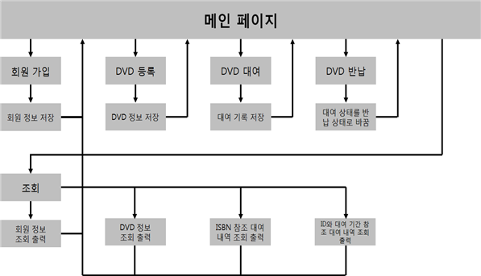

# Book Management System

- DVD 대출/반납/조회 기능을 C Code로 구현한 프로그램입니다.

# 개요

- 본 DVD 관리 프로그램은 등록된 회원 아이디로만 등록된 DVD의 대출이 가능하도록 구현하였습니다.

- '회원 가입' 과 '도서 등록' 기능에서 중복 ID/ISBN을 입력할 경우 에러 메세지를 띄우며 처음 화면으로 돌아가게 됩니다.

- 현재 대여 중인 DVD는 중복 대여 되지 않도록 에러 메세지를 띄우고 처음 화면으로 돌아가게 됩니다.

- DVD 대여 조회시 ISBN을 입력하여 조회하는 기능과 사용자 ID와 기간을 지정하여 조회 가능하도록 구현하였습니다.

# 시스템 구조도

- 단 방향 연결리스트로 각각 입력 받은 정보(회원 정보, DVD 정보, 대여 정보)를 프로그램 상에 저장하여 부럴오는 식으로 구동합니다.

- 파일 입출력 방식으로 CusLis(회원 정보), DVDList(DVD 정보), RentList(대여 정보)를 관리하여 프로그램 종료 후 재 실행 하여도 이전 기록을 불러올 수 있습니다.

- 각각의 *List.txt 파일의 갱신은 프로그램이 종료 되었을 때에만 이루어집니다.

# 개발환경

- OS : Windows 7 Professional K

- CPU : Intel(R) Core(TM) i7-4790 CPU @ 3.60GHz 

- RAM : 8GB

- IDE : Microsoft Visual studio 2017 Version 15.9.6

- Compiler : Version_MSC_VER 1916

- Language : C

# 구동 영상 URL

[바로가기](https://youtu.be/XkpcspyntJk)

# 추후 개선 사항

- 데이터베이스 서버를 구축하여 입력 받은 데이터를 DB에 저장하여 서버를 통해 불러오고 저장할 수 있도록 구현 할 필요성이 있습니다.

- 단방향이 아닌 양방향 연결리스트로 구현하여 데이터 삭제 기능을 추가하여 프로그램 실행으로 데이터의 수정, 삭제가 용이하도록 구현 할 필요성이 있습니다.
